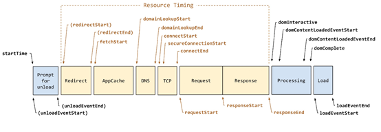

---
nav:
  title: performance
  order: 2
toc: menu
order: 100
---

# performance

## 知识点

- 图片懒加载和预加载
- 白屏和首屏
- 如何减少白屏时间和首屏时间
- 卸载旧页面到新页面加载的过程
- 总结

## 图片预加载

预加载简单来说就是将所有所需的资源提前请求加载到本地，这样后面在需要用到时就直接从缓存取资源。常用于 hover 图片转化时，这样可以防止图片闪烁。

## 图片懒加载

懒加载就是当图片出现在可视区域范围内时再请求图片资源，而不是一开始就请求。

懒加载的实现原理主要是先将所有图片的 src 设置为一个比较小的占位图，等图片到可视区时，将图片的 src 替换为他真正的链接。

## 白屏和首屏

可以在控制台输入 window.performance.getEntriesByType('paint')来获取 First Paint（FP：文档中任意元素首次渲染时间，首屏时间）和 First Contentful Paint（FCP：第一次有内容的渲染，白屏时间）。

FP(First Paint)：页面在导航后首次呈现出不同于导航前内容的时间点。
FCP(First Contentful Paint)：首次绘制任何文本，图像，非空白 canvas 或 SVG 的时间点。

## 如何减少白屏时间和首屏时间

- 将 script 放在 body 后面（原因可以看这篇文章将 script 放在 body 中内容的最后的原因详解）
- 减少 head 里的 css 资源，图片 gzip
- 资源动态加载（路由、组件、图片）
- 做一些缓存
- 在首屏加载完成之前，通过渲染一些简单元素进行占位（骨架屏）
- 引入 http2.0
- 选择先进的图片格式，使用 JPEG 2000, JPEG XR, and WebP 的图片格式来代替现有的 jpeg 和 png
- 做一些 http 压缩。http 压缩通常是通过在 reponse header 指定 Content-Encoding 首部，告诉客户端 response 的压缩格式，这样客户端才能正确解压。最常用 gzip（压缩率和兼容性都较好），新出来 br（压缩率很高，兼容性不是很好）

## 卸载旧页面到新页面加载的过程

## 总结

- 上面的图片懒加载
- 减少白屏时间
- js 尽可能少的操作 DOM，减少回流，适当地使用事件委托
- 注意手动释放不需要再使用的对象，防止内存泄漏
- 减少 http 请求数，这个可以通过设置 http 缓存、资源合并、接口合并来实现
- 路由懒加载
