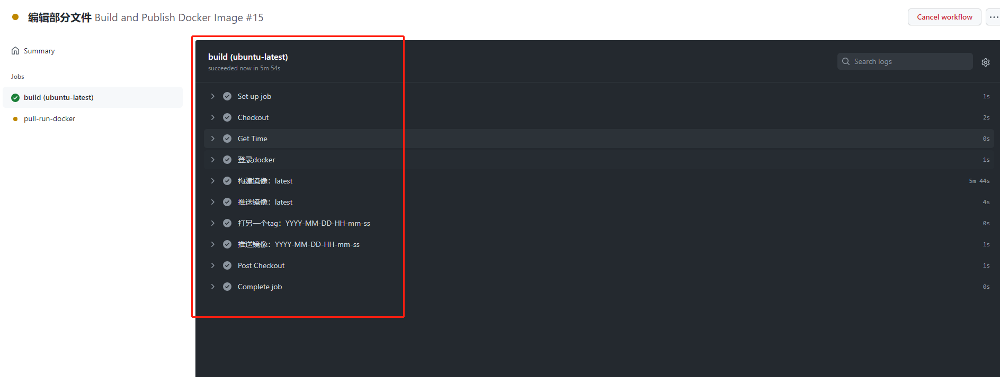
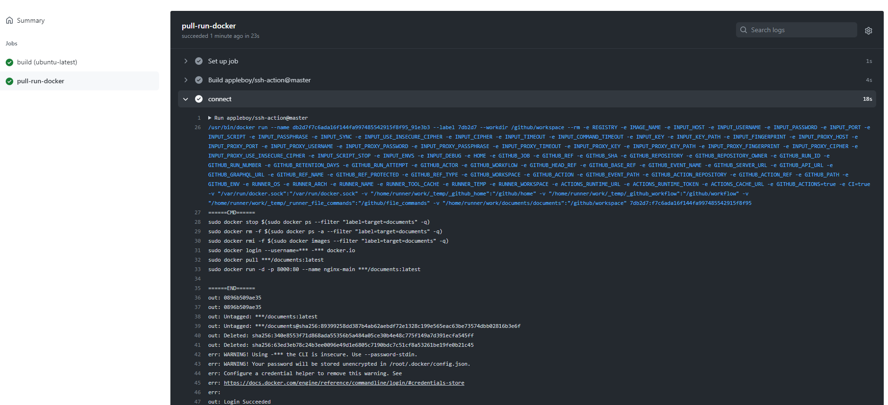

---
nav:
  title: github actions
  order: 2
toc: menu
order: 1
---

# github actions

## 介绍

github actions 是 github 提供的一个持续集成的功能，使用`yml`编写脚本，位于项目根目录下的`.github/workflows/`文件夹下，在一定条件下会触发。

## 语法

TODO

语法还是较为简单的，然后还有官方的各种示例作为参考

## 配置示例

### 发布一个 vscode 插件

```yml
on:
  push:
    branches:
      - master
  release:
    types:
      - created

jobs:
  build:
    strategy:
      matrix:
        # os: [macos-latest, ubuntu-latest, windows-latest]
        os: [windows-latest]
    runs-on: ${{ matrix.os }}
    steps:
      - name: Checkout
        uses: actions/checkout@v2
      # 修改了node版本：成功
      - name: Install Node.js
        uses: actions/setup-node@v1
        with:
          node-version: 14.18.3
      # 安装python成功
      - name: Set up Python 3.10
        uses: actions/setup-python@v2
        with:
          python-version: '3.10'
      - run: npm install
      - run: npm install -g vsce yarn
      - run: npm run deploy
        env:
          VSCE_PAT: ${{ secrets.VSCE_PAT }}
```

### 构建一个 docker 镜像

```yml
# 脚本名称
name: Build and Publish Docker Image

# 触发时机
on:
  push:
    branches:
      - master
  release:
    types:
      - created

# 环境，下面可以引用变量
env:
  # Use docker.io for Docker Hub if empty
  REGISTRY: docker.io
  # <repo>
  IMAGE_NAME: ${{ github.event.repository.name }}

# 多个工作
jobs:
  build:
    strategy:
      matrix:
        os: [ubuntu-latest]
    runs-on: ${{ matrix.os }}
    steps:
      - name: Checkout
        uses: actions/checkout@v2

      - name: Get Time
        id: time
        uses: nanzm/get-time-action@v1.1
        with:
          timeZone: 8
          format: 'YYYY-MM-DD-HH-mm-ss'

      - name: Log into registry ${{ env.REGISTRY }}
        if: github.event_name != 'pull_request'
        uses: docker/login-action@v1
        with:
          registry: ${{ env.REGISTRY }}
          username: ${{ secrets.DOCKER_HUB_USER }}
          password: ${{ secrets.DOCKER_HUB_TOKEN }}

      - name: Extract Docker metadata
        id: meta
        uses: docker/metadata-action@v3
        with:
          images: ${{ env.REGISTRY }}/${{ secrets.DOCKER_HUB_USER }}/${{ env.IMAGE_NAME }}

      - name: Set up Docker Buildx
        id: buildx
        uses: docker/setup-buildx-action@v1

      - name: Build and push Docker image
        uses: docker/build-push-action@v2
        with:
          context: .
          push: ${{ github.event_name != 'pull_request' }}
          tags: ${{ steps.meta.outputs.tags }}-${{ steps.time.outputs.time }}
          labels: ${{ steps.meta.outputs.labels }}
```

### 构建一个 docker 镜像 2

不借助`docker actions`，直接使用 docker 命令：

```yml
name: Build and Publish Docker Image

on:
  push:
    branches:
      - master
  release:
    types:
      - created

env:
  # Use docker.io for Docker Hub if empty
  REGISTRY: docker.io
  # <repo>
  IMAGE_NAME: ${{ github.event.repository.name }}

jobs:
  build:
    strategy:
      matrix:
        os: [ubuntu-latest]
    runs-on: ${{ matrix.os }}
    steps:
      - name: Checkout
        uses: actions/checkout@v2

      - name: Get Time
        id: time
        uses: nanzm/get-time-action@v1.1
        with:
          timeZone: 8
          format: 'YYYY-MM-DD-HH-mm-ss'

      - name: 登录docker
        run: docker login --username=${{ secrets.DOCKER_HUB_USER }} --password ${{ secrets.DOCKER_HUB_TOKEN }} ${{ env.REGISTRY }}
      - name: 构建镜像：latest
        run: docker build -t ${{ secrets.DOCKER_HUB_USER }}/${{ env.IMAGE_NAME }}:latest .
      - name: 推送镜像：latest
        run: docker push ${{ secrets.DOCKER_HUB_USER }}/${{ env.IMAGE_NAME }}:latest
      - name: 打另一个tag：YYYY-MM-DD-HH-mm-ss
        run: docker tag ${{ secrets.DOCKER_HUB_USER }}/${{ env.IMAGE_NAME }}:latest ${{ secrets.DOCKER_HUB_USER }}/${{ env.IMAGE_NAME }}:${{ steps.time.outputs.time }}
      - name: 推送镜像：YYYY-MM-DD-HH-mm-ss
        run: docker push ${{ secrets.DOCKER_HUB_USER }}/${{ env.IMAGE_NAME }}:${{ steps.time.outputs.time }}
```

结果：



### ssh 连接远程服务器，运行镜像

```yml
...

jobs:

  ...

  run:
    needs: [build]
    name: pull-run-docker
    runs-on: ubuntu-latest
    steps:
      - name: connect
        uses: appleboy/ssh-action@master
        with:
          host: ${{ secrets.HOST }} # 服务器ip
          username: ${{ secrets.HOST_USERNAME }} # 服务器登录用户名
          password: ${{ secrets.HOST_PASSWORD }} # 服务器登录密码
          port: ${{ secrets.HOST_PORT }} # 服务器ssh端口
          script: |
            sudo docker stop $(sudo docker ps --filter "label=target=documents" -q)
            sudo docker rm -f $(sudo docker ps -a --filter "label=target=documents" -q)
            sudo docker rmi -f $(sudo docker images --filter "label=target=documents" -q)
            sudo docker login --username=${{ secrets.DOCKER_HUB_USER }} --password ${{ secrets.DOCKER_HUB_TOKEN }} ${{ env.REGISTRY }}
            sudo docker pull ${{ secrets.DOCKER_HUB_USER }}/documents:latest
            sudo docker run -d -p 8000:80 --name nginx-main ${{ secrets.DOCKER_HUB_USER }}/documents:latest
```

结果：


