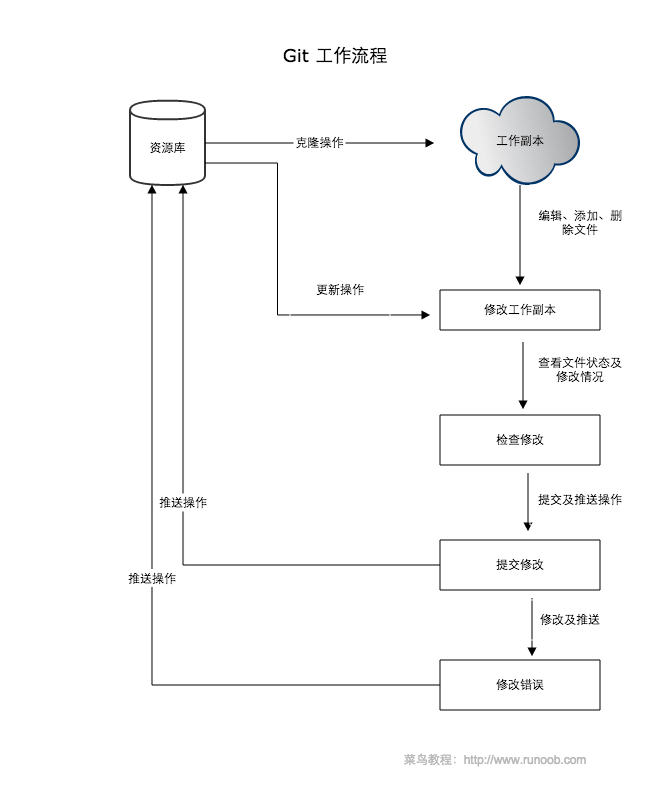
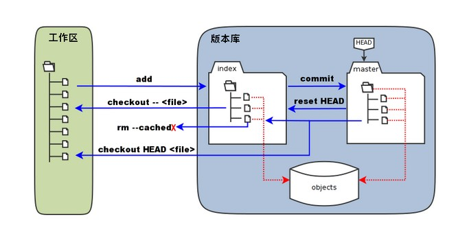

# git 基础

## git 工作流程

- 克隆，克隆 Git 资源作为工作目录。
- 编辑，在克隆的资源上添加或修改文件。
- 更新，如果其他人修改了，你可以更新资源。
- 提交，在提交前查看修改，提交修改。
- 撤回，在修改完成后，如果发现错误，可以撤回提交并再次修改并提交。

## 安装

Git 各平台安装包下载地址为：[http://git-scm.com/downloads](http://git-scm.com/downloads)

- windows，安装包下载地址：[https://gitforwindows.org/](https://gitforwindows.org/)
- mac，[http://sourceforge.net/projects/git-osx-installer/](http://sourceforge.net/projects/git-osx-installer/)
- linux，`apt-get install git`

## 工作区、暂存区、版本库

- 工作区：简单理解就是你在电脑里能看到的目录。
- 暂存区：英文叫 stage 或 index。一般存放在 .git 目录下的 index 文件（.git/index）中，所以我们把暂存区有时也叫作索引（index）。
- 版本库：工作区有一个隐藏目录 .git，这个不算工作区，而是 Git 的版本库。

下图展示了工作区、版本库中的暂存区、版本库之间的关系：

- 图中左侧为工作区，右侧为版本库。在版本库中标记为 "index" 的区域是暂存区（stage/index），标记为 "master" 的是 master 分支所代表的目录树。

- 图中我们可以看出此时 "HEAD" 实际是指向 master 分支的一个"游标"。所以图示的命令中出现 HEAD 的地方可以用 master 来替换。

- 图中的 objects 标识的区域为 Git 的对象库，实际位于 ".git/objects" 目录下，里面包含了创建的各种对象及内容。

- 当对工作区修改（或新增）的文件执行 git add 命令时，暂存区的目录树被更新，同时工作区修改（或新增）的文件内容被写入到对象库中的一个新的对象中，而该对象的 ID 被记录在暂存区的文件索引中。

- 当执行提交操作（git commit）时，暂存区的目录树写到版本库（对象库）中，master 分支会做相应的更新。即 master 指向的目录树就是提交时暂存区的目录树。
