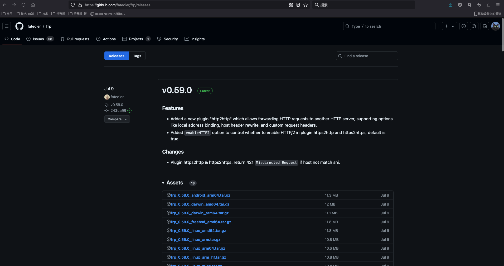

# 安装

## 下载

从 github 的[release](https://github.com/fatedier/frp/releases)中获取最新版本的客户端和服务器二进制文件，目前最新版本是`0.59.0`。



[资源备份](https://www.teambition.com/project/656db483127225c2ecd166ae/works/66b7f615fb784af50fcbdf4b)

## 服务器端（有公网 ip 的主机）

将 frps 文件和 frps.toml 放 `/www/server/frp/` 目录（目录可以自己决定，启动命令的目录根据你实际情况修改）

配置文件 frps.toml 如下：

```shell
# frp服务端口，客户通过此端口链接服务,需在服务器中开放端口。阿里云、腾讯云注意控制台中也要开放对应的端口
bindPort = 7000
# http服务绑定的端口,需在服务器中开放
vhostHTTPPort = 8888
# 所有客户端链接都需要通过此验证
auth.method = "token"
auth.token="123456"

# web控制台，如果不需要可注释掉
webServer.addr = "0.0.0.0"
webServer.port = 7500
webServer.user = "uer"
webServer.password = "你的密码"

# 日志输出配置
# log.to = "/www/server/frp/log.txt"
# log.level = "info"
```

启动命令：`/www/server/frp/frps -c /www/server/frp/frps.toml`

这里先简单启动测试下，最好[使用 systemd 来管理 frps 服务](./systemd)。

成功的话，打开控制面板`7500`端口（需要输入上面配置的账号、密码）会出现如下页面：


## 客户端（本地提供服务的主机）

```shell
# 链接公网服务的配置,和上一个服务端配置对应
serverAddr = "*.*.*.*"
serverPort = 7000
auth.method = "token"
auth.token = "123456"

# 日志输出配置
# log.to="C:/frp/log.txt"
# log.level="info"

# 客户端web控制台配置
# webServer.addr = "127.0.0.1"
# webServer.port = 7500

# （1）开放本地文件系统到公网-通过公网服务器ip:8887访问
[[proxies]]
name = "static_file"
type = "tcp"
# 服务器上也要开放此端口，注意阿里云、腾讯云控制台也要开放
remotePort = 8887
# http方式开放本地文件系统
[proxies.plugin]
type = "static_file"
# 本地文件目录，对外提供访问的路径
localPath = "D:/share"
# 网页访问的账号密码
httpUser = "admin"
httpPassword = "987654321"

# （2）开放本地服务系统到公网，http方式,可以绑定域名，请将域名解析到你的公网服务器
# 访问方式，浏览器直接输入：www.xxxxx.com:8888，端口是服务器端配置的vhostHTTPPort
[[proxies]]
name = "nasweb"
type = "http"
# 本地服务ip:端口,可以是本机也可以局域网其他主机，比如：192.168.*.*,127.0.0.1
localIP = "127.0.0.1"
localPort = 80
customDomains = ["www.xxxxx.com"]

# （3）stcp方式开放nas系统给访问客户端，只能配置了frpc访问端的主机才能访问
[[proxies]]
name = "nasstcp"
type = "stcp"
# 只有与此处设置的 secretKey 一致的用户才能访问此服务
secretKey = "345678"
localIP = "127.0.0.1"
localPort = 80

# （4）p2p方式开放nas系统给访问客户端，只能配置了frpc访问端的主机才能访问，不占用服务器带宽，适合大文件，NAS等
[[proxies]]
name = "nasp2p"
type = "xtcp"
# 只有共享密钥 (secretKey) 与服务器端一致的用户才能访问该服务
secretKey = "654321"
localIP = "127.0.0.1"
localPort = 80

# 以上所有的[[proxies]] 配置根据需要设置，不需要的可以删除掉，上面示例配置做一个说明
#（1）一个文件共享系统
#（2）将本地服务直接共享公网，并配置域名，比如本地搭建的一个网站
#（3）安全的方式提供服务，需要访问者配置访问端，类似与私有的网站或者服务访问
#（4）p2p（内网主机直连）的形式，需要访问者配置访问端，跟3差不多，区别是此方式流量不经过服务器
```

window 系统中设置开机启动，创建文件：frpc.vbs （如果是本地 linux 主机，可以用上面服务器端那种方式配置守护进程）。

我的`frpc.exe`和`frpc.toml`这两个文件都是放在`D:\programs\frp\`这个目录下面的。

```vbs
set ws=wscript.createobject("wscript.shell")
ws.run "cmd /c D:\programs\frp\frpc -c D:\programs\frp\frpc.toml",0
```

执行该文件，在服务端的控制面板上`*.*.*.*:7500`就可以看到有客户端连进来了


:::info 开机自启
将该启动文件放到 C:\ProgramData\Microsoft\Windows\Start Menu\Programs\StartUp 即可开机自动启动。
:::

:::warning 加入防火墙白名单
注意要把运行目录加入防火墙白名单，不然可能会被杀毒。
:::
