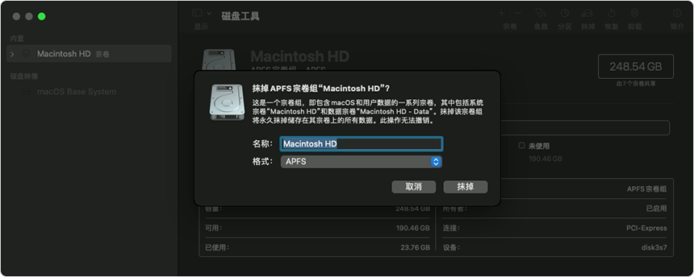

# 重装系统

因为电脑比较老了，一直闲置在那里，准备重装系统，搭建一个内网服务器，记录下重装的步骤。

我的 macbook： `macbook 2017 air`

芯片：`intel`

系统：`Monterey`

## 操作步骤

1. 重新启动时，按住 Command (⌘) 和 R 这两个按键，从“macOS 恢复”启动
2. 使用“磁盘工具”抹掉 Mac
3. 重新安装系统

[官网操作链接](https://support.apple.com/zh-cn/102639)
