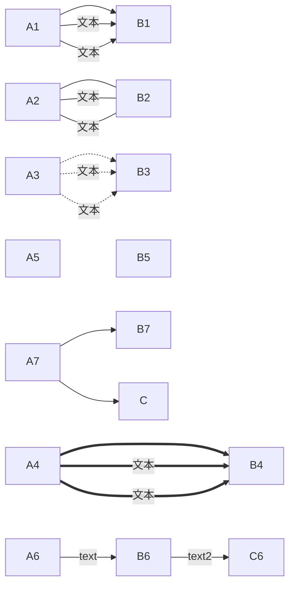

```mermaid
flowchart LR
    %% 带箭头的链接
    A1 --> B1
    A1 -- 文本 --> B1
    A1 --> |文本| B1

    %% 打开的链接
    A2 --- B2
    A2 --- |文本| B2
    A2 -- 文本 --- B2

    %% 虚线
    A3 -.-> B3
    A3 -. 文本 .-> B3
    A3 -.-> |文本| B3

    %% 粗链接
    A4 ==> B4
    A4 == 文本 ===> B4
    A4 ==> |文本| B4

    %% 看不见的链接
    A5 ~~~ B5

    %% 链接的链接
    A6 -- text --> B6 -- text2 --> C6
    A7 --> B7 & C
```
