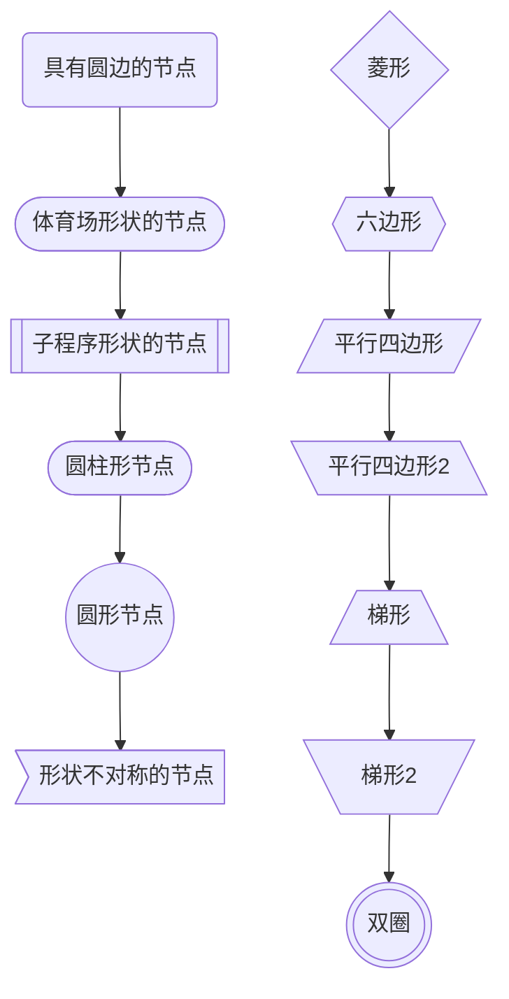

```mermaid
flowchart TB
    id1(具有圆边的节点)
    id2([体育场形状的节点])
    id3[[子程序形状的节点]]
    id4([圆柱形节点])
    id5((圆形节点))
    id6>形状不对称的节点]

    id1 --> id2 --> id3 --> id4 --> id5 --> id6

    idA1{菱形}
    idA2{{六边形}}
    idA3[/平行四边形/]
    idA4[\平行四边形2\]
    idA5[/梯形\]
    idA6[\梯形2/]
    idA7(((双圈)))

    idA1 --> idA2 --> idA3 --> idA4 --> idA5 --> idA6 --> idA7
```
