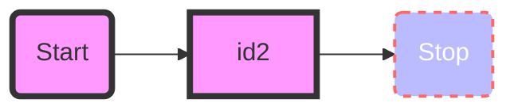

```mermaid
flowchart LR
    id1(Start) --> id2 --> id3(Stop)
    classDef class1,class2 fill:#f9f,stroke:#333,stroke-width:4px
    classDef class3 fill:#bbf,stroke:#f66,stroke-width:2px,color:#fff,stroke-dasharray: 5 5
    class id1,id2 class1
    class id3 class3
```
