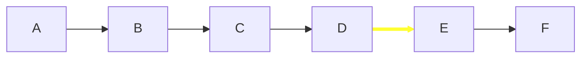
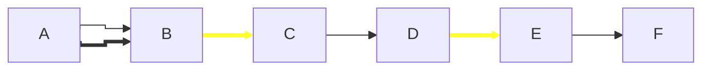

```mermaid
flowchart LR
    A --> B --> C --> D --> E --> F
    linkStyle 3 stroke:#ff3,stroke-width:4px,color:red;
```

```mermaid
%%{ init: { 'flowchart': { 'curve': 'stepBefore' } } }%%
flowchart LR
    A --> B --> C --> D --> E --> F
    A ==> B
    linkStyle 1,3 stroke:#ff3,stroke-width:4px,color:red;
```
