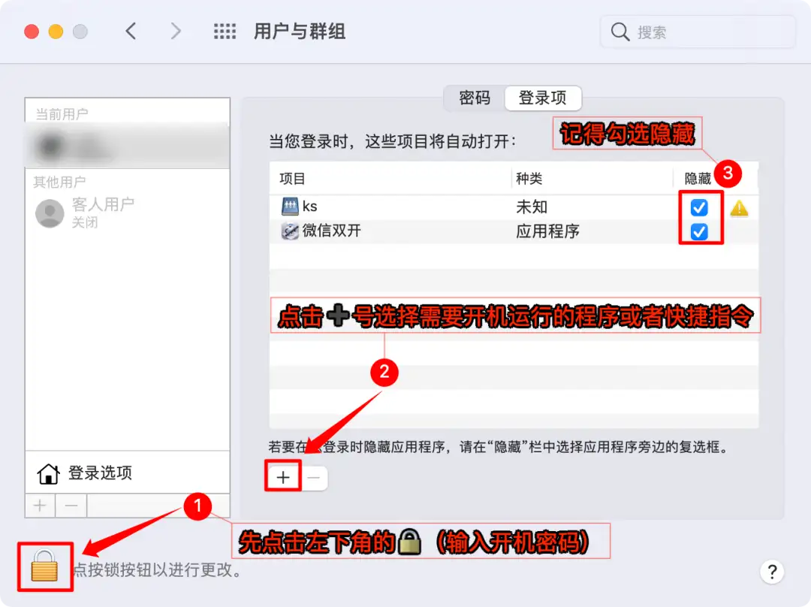

# macOS 系统部分操作整理

## 开机自启动应用

可能不同的系统版本有不一样的入口/方法，不过大都差不多

### 方法一、从 dock 设置

### 方法二、设置登录项

【系统偏好设置】-【用户与群主】-【登录项】

## 重装系统

因为电脑比较老了，一直闲置在那里，准备重装系统，搭建一个内网服务器，记录下重装的步骤。

我的 macbook： `macbook 2017 air`

芯片：`intel`

系统：`Monterey`

### 操作步骤

1. 重新启动时，按住 Command (⌘) 和 R 这两个按键，从“macOS 恢复”启动
2. 使用“磁盘工具”抹掉 Mac
3. 重新安装系统

[官网操作链接](https://support.apple.com/zh-cn/102639)

## 开机自动登录

步骤：

【系统偏好设置】-【用户与群组】- 【登录选项】-【选择自动登录的用户】

## 更改睡眠选项

### 系统设置

参考[设定 Mac 的睡眠和唤醒设置](https://support.apple.com/zh-cn/guide/mac-help/mchle41a6ccd/mac)

一般就是【设置】-【电池】/【屏幕保护程序】/【锁定屏幕】/【节能】等等

### 第三方软件

`CoffeeTea`等
