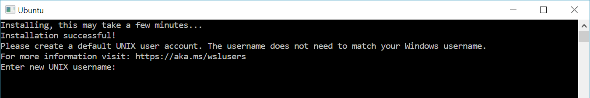

# wsl2

参考[官网](https://learn.microsoft.com/zh-cn/windows/wsl/install-manual)的安装步骤，实践如下：

## 1. 启用适用于 Linux 的 Windows 子系统

以管理员身份打开 PowerShell，运行

```shell
dism.exe /online /enable-feature /featurename:Microsoft-Windows-Subsystem-Linux /all /norestart
```

## 2. 检查运行 WSL 2 的要求

具体参考官网了，我的机器上是满足的

## 3. 启用虚拟机功能

以管理员身份打开 PowerShell，运行

```shell
dism.exe /online /enable-feature /featurename:VirtualMachinePlatform /all /norestart
```

**重新启动计算机**，以完成 WSL 安装并更新到 WSL 2。

## 4. 下载 Linux 内核更新包

- [x64 下载地址](https://wslstorestorage.blob.core.windows.net/wslblob/wsl_update_x64.msi)
- 双击运行

## 5. 将 WSL 2 设置为默认版本

```shell
wsl --set-default-version 2
```

## 6. 安装所选的 Linux 分发

[Ubuntu 22.04 LTS](https://www.microsoft.com/store/apps/9PN20MSR04DW)

首次启动新安装的 Linux 分发版时，将打开一个控制台窗口，系统会要求你等待一分钟或两分钟，以便文件解压缩并存储到电脑上。 未来的所有启动时间应不到一秒。

然后，需要为新的 Linux 分发版创建用户帐户和密码。



[更多 wsl2 使用](https://blog.csdn.net/q283614346/article/details/138790776)
