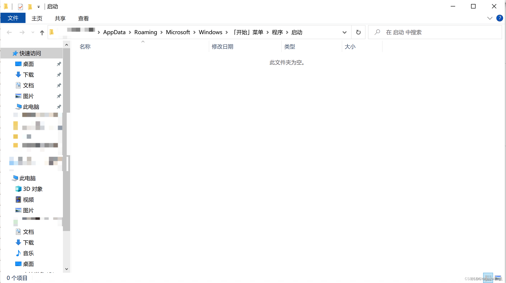
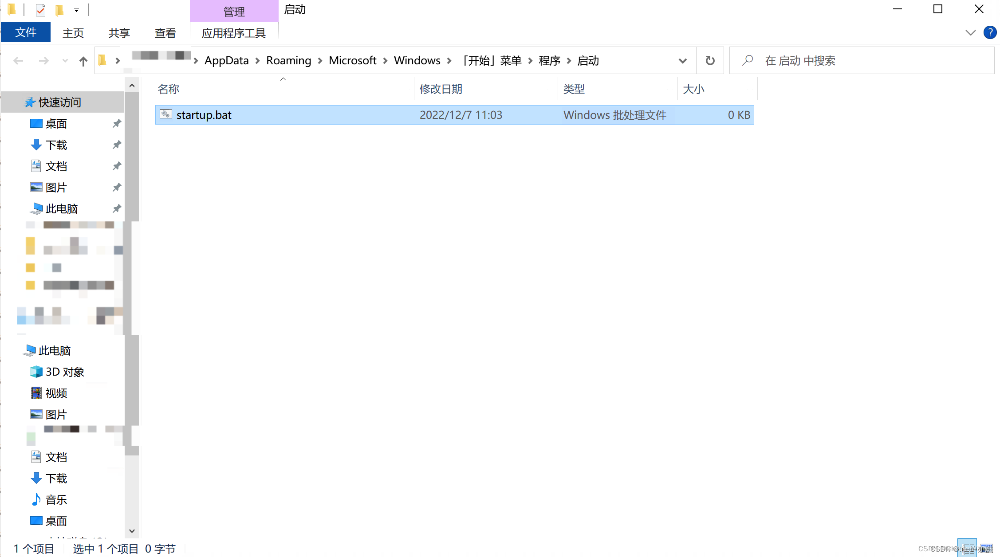
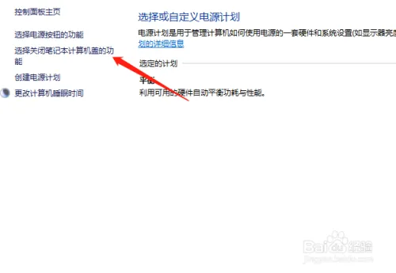
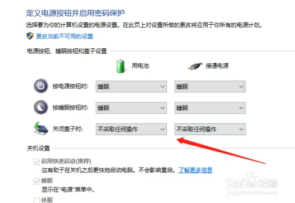
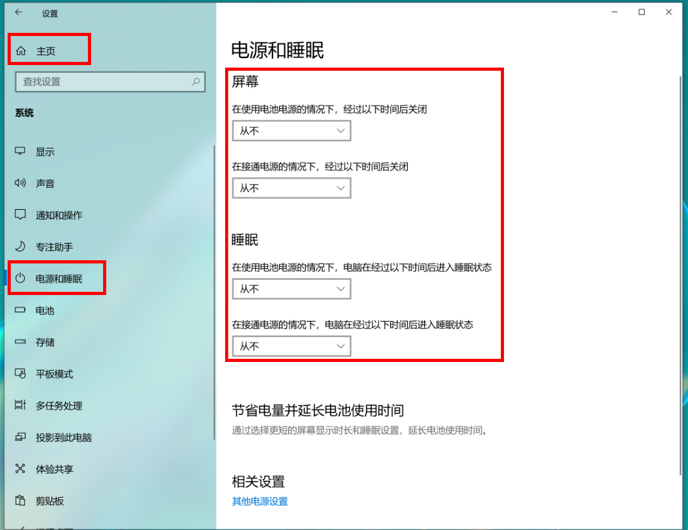
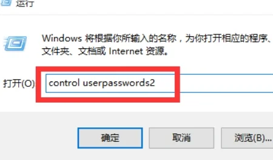
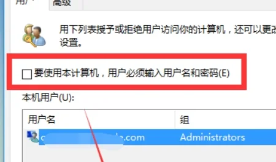

# windows 系统部分操作整理

## bat 脚本

### 在 bat 脚本中运行 node 脚本

因为是比较熟悉前端，所以更习惯使用 node 编写脚本，语法如下：

```bat
node script.js arg1 arg2 & node script.js2
```

### 开机自启动

将编写的 bat 脚本文件，放置在"启动"文件夹内就行。

参考[设置开机自启动任务](#设置开机自启动任务)

### 其他

略

## 设置开机自启动任务

原理：Windows 下面有一个启动文件夹，可以通过将脚本放入启动文件夹里面运行自启动程序。

步骤：

- 进入启动文件夹【进入“运行”下面输入 shell:Startup】




- 将启动脚本放到启动文件夹里面，在用户登录的时候就会后台自启动该脚本



更多方法参考：[Windows10 设置开启自启动任务](https://blog.csdn.net/qq_16005627/article/details/132870874)

## 更改睡眠选项

场景：笔记本电脑
目标：关闭盖子不睡眠，任意长时间不睡眠
操作如下：

### 关闭盖子不睡眠

- 路径：【硬件和声音】-【电源选项】-【关闭笔记本计算机盖的功能】
  
- 选择：【不采取任何操作】
  

### 电源和睡眠

- 路径：【系统】-【电源和睡眠】
- 选择：【从不】
  

## 开机自动登录

### 步骤

- 路径：【开始菜单】-【运行】-【输入：control userpasswords2】
  
- 打开“用户账户”的属性，取消“要使用本机，用户必须输入用户名和密码(E)”的勾选，然后按下“确定”。
  

### 踩坑记录

1. windows10 没有要使用本机用户必须输入账户密码

通过修改注册表来恢复选项

```
Windows Registry Editor Version 5.00

[HKEY_LOCAL_MACHINE\SOFTWARE\Microsoft\Windows NT\CurrentVersion\PasswordLess\Device]
"DevicePasswordLessBuildVersion"=dword:00000002
"DevicePasswordLessBuildVersion"=dword:00000000
```

将文件保存为`.reg`格式，例如`恢复.reg`，然后双击运行该文件，确认导入注册表更改，重启生效。
