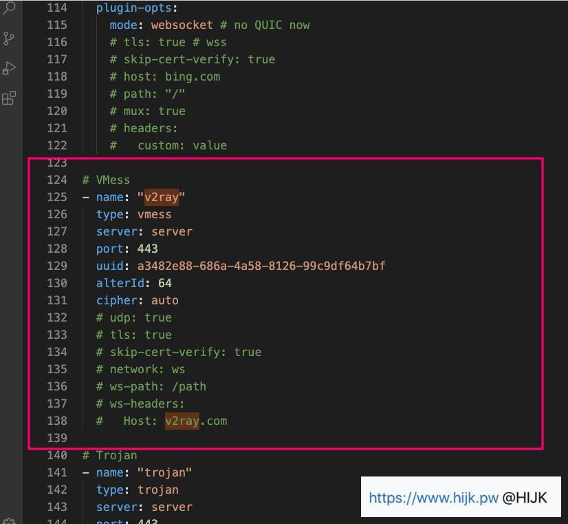
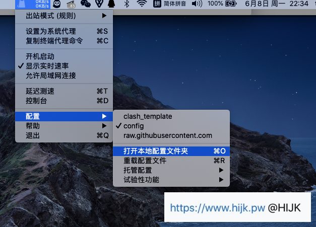
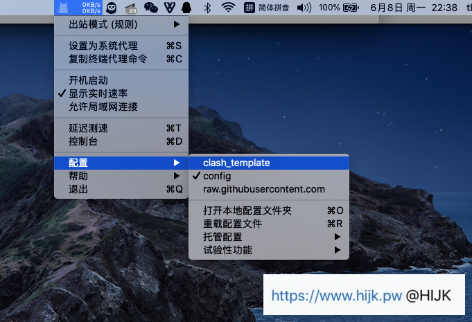
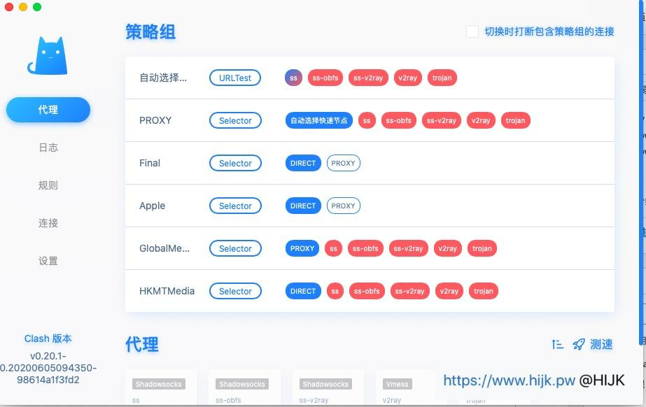
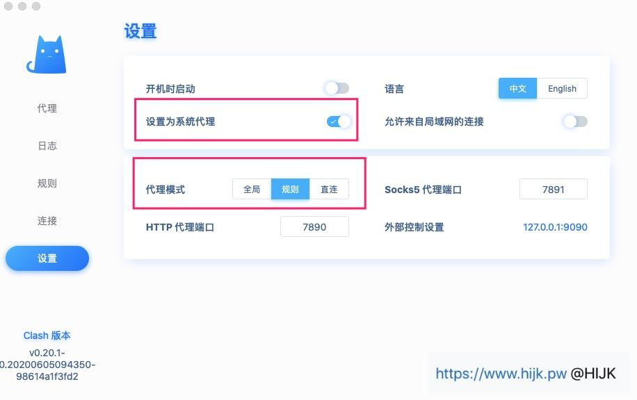

# 安装

## 服务器端

服务器系统：`ubuntu 24.04`/`debian 11.3`

v2ray 版本：`4.34.0`

步骤：

```bash
# 更新系统软件包
sudo apt update

# 安装V2Ray
sudo apt install v2ray

# 启动V2Ray
sudo systemctl start v2ray

# 设置V2Ray开机自启动
sudo systemctl enable v2ray

# 查看V2Ray状态
sudo systemctl status v2ray

# 重新启动V2Ray
sudo systemctl restart v2ray
```

:::details 配置

文件路径：`/etc/v2ray/config.json`

配置详情：

```json
{
  "inbounds": [
    {
      "port": 8900,
      "protocol": "vmess",
      "settings": {
        "clients": [
          {
            "id": "b831381d-6324-4d53-ad4f-8cda48b30811",
            "level": 0,
            "alterId": 64
          }
        ]
      }
    }
  ],
  "outbounds": [
    {
      "protocol": "freedom",
      "settings": {}
    }
  ]
}
```

:::

## 客户端

### 安装 ClashX

[(ClashX-Pro-v1.116.1.1.dmg)](https://v2xtls.org/download.php?filename=/v2/macos/ClashX-Pro-v1.116.1.1.dmg)

### 下载配置文件

[https://v2xtls.org/clash_template2.yaml](https://v2xtls.org/clash_template2.yaml)

### 编辑配置文件

找到 v2ray 配置块，把 server、port、uid 等信息改成你服务端配置



### 应用配置文件





### 客户端设置（控制台）



- PROXY 选择使用的节点：默认是“自动选择快速节点”，也可以指定使用某个节点。
- Final 选择默认规则：DIRECT 表示直连，PROXY 走代理。个人建议使用直连，网站打不开再选择代理。

- 在主界面点击“设置”，设置启用系统代理和选择代理模式



代理模式有全局、规则和直连，(可以认为)对应其他客户端的全局模式、PAC 模式和禁用系统代理。绝大多数情况建议使用规则模式。

### 资源备份

- [(ClashX-Pro-v1.116.1.1.dmg)](https://www.teambition.com/project/656db483127225c2ecd166ae/works/66c055b659e751b91b6d703e/work/66c055ff820247a57b18e09a)
- [https://v2xtls.org/clash_template2.yaml](../../resources/clash_template2.yaml)

## 参考

- [服务器 v2ray 搭建教程](https://cloud.tencent.com/developer/information/%E5%85%8D%E8%B4%B9%E6%9C%8D%E5%8A%A1%E5%99%A8v2ray%E6%90%AD%E5%BB%BA%E6%95%99%E7%A8%8B-album)
- [ClashX 配置 V2ray 教程](https://v2xtls.org/clashx%e9%85%8d%e7%bd%aev2ray%e6%95%99%e7%a8%8b/)
