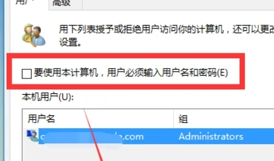

# 开机自动登录

## 步骤

- 路径：【开始菜单】-【运行】-【输入：control userpasswords2】
  
- 打开“用户账户”的属性，取消“要使用本机，用户必须输入用户名和密码(E)”的勾选，然后按下“确定”。
  

## 踩坑记录

1. windows10 没有要使用本机用户必须输入账户密码

通过修改注册表来恢复选项

```
Windows Registry Editor Version 5.00

[HKEY_LOCAL_MACHINE\SOFTWARE\Microsoft\Windows NT\CurrentVersion\PasswordLess\Device]
"DevicePasswordLessBuildVersion"=dword:00000002
"DevicePasswordLessBuildVersion"=dword:00000000
```

将文件保存为`.reg`格式，例如`恢复.reg`，然后双击运行该文件，确认导入注册表更改，重启生效。
