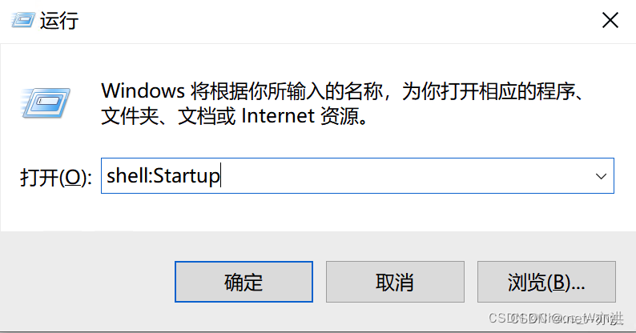
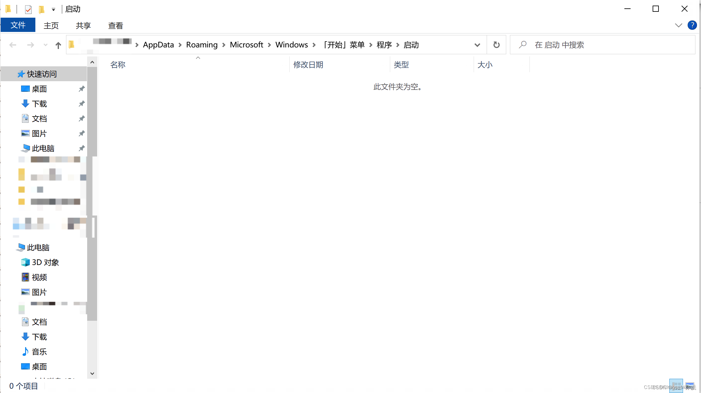

# 设置开机自启动任务

原理：Windows 下面有一个启动文件夹，可以通过将脚本放入启动文件夹里面运行自启动程序。

步骤：

- 进入启动文件夹【进入“运行”下面输入 shell:Startup】

- 将启动脚本放到启动文件夹里面，在用户登录的时候就会后台自启动该脚本

更多方法参考：[Windows10 设置开启自启动任务](https://blog.csdn.net/qq_16005627/article/details/132870874)
