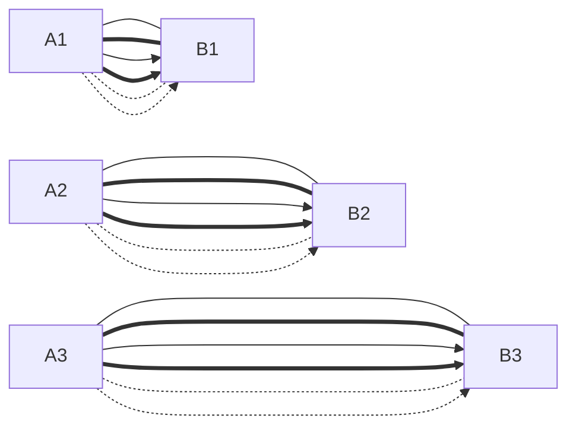

```mermaid
flowchart LR
    %% 长度为1
    A1 --- B1
    A1 === B1
    A1 --> B1
    A1 ==> B1
    A1 -.- B1
    A1 -.-> B1

    %% 长度为2
    A2 ---- B2
    A2 ==== B2
    A2 ---> B2
    A2 ===> B2
    A2 -..- B2
    A2 -..-> B2

    %% 长度为3
    A3 ----- B3
    A3 ===== B3
    A3 ----> B3
    A3 ====> B3
    A3 -...- B3
    A3 -...-> B3
```
