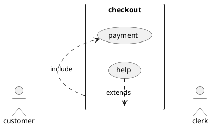
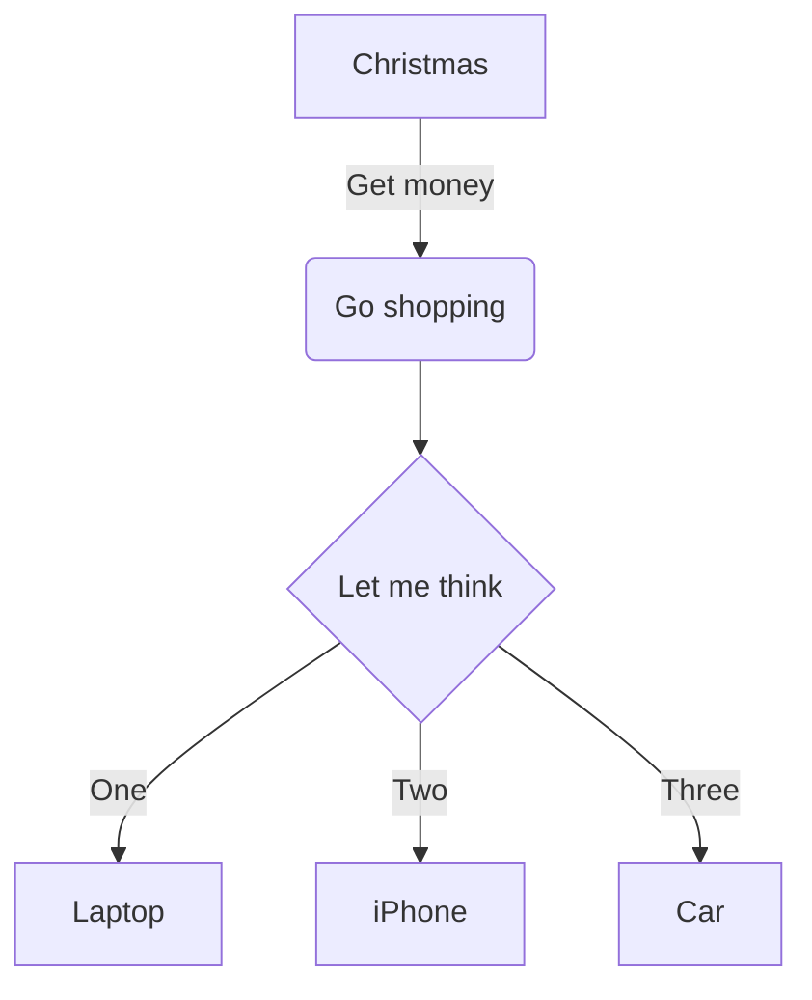
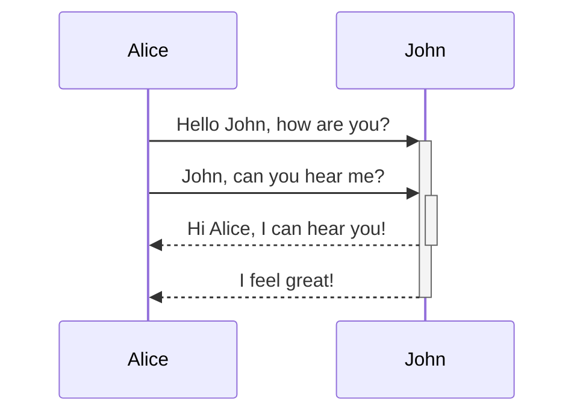
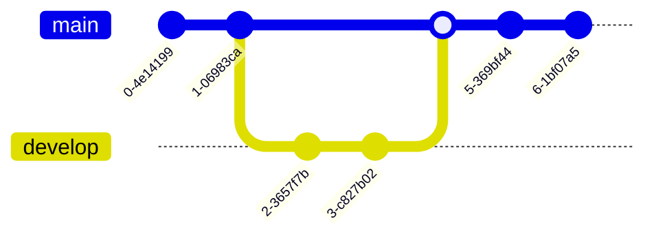
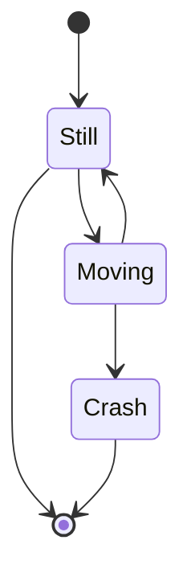
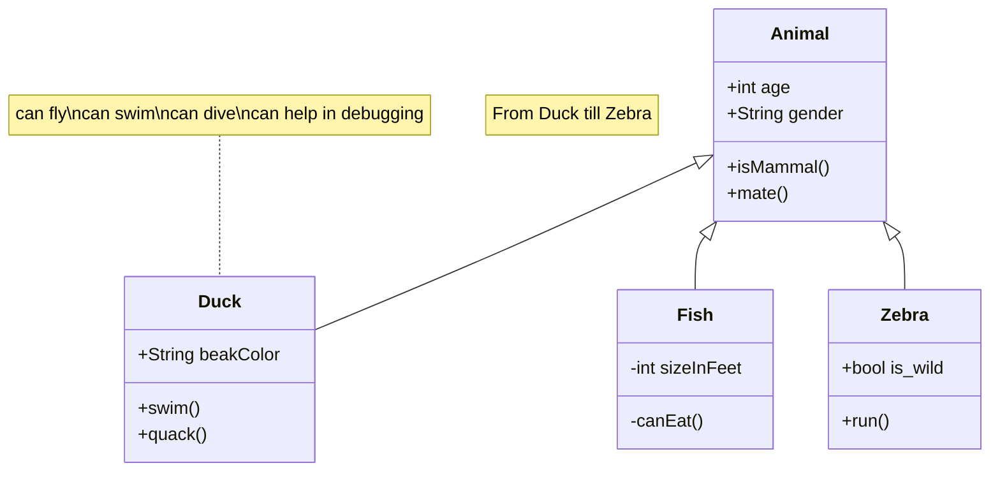

# Mermaid

## 介绍

基于 JavaScript 的图表工具，可渲染 Markdown 启发的文本定义以动态创建和修改图表。

[Mermaid 官网](https://mermaid.nodejs.cn/)

## 示例

### 流程图

:::vp_demo

:::

### 时序图

:::vp_demo

:::

### Git 图

:::vp_demo

:::

### 状态图

:::vp_demo

:::

### 类图

:::vp_demo

:::
