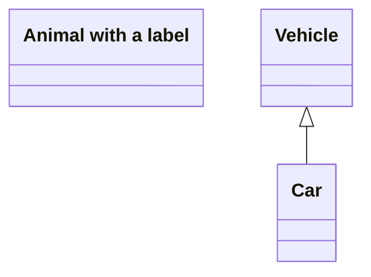
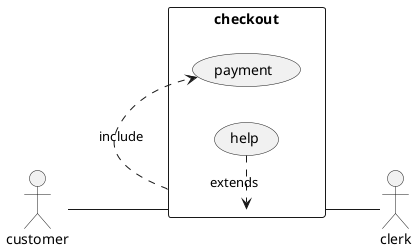

<!-- @col-start -->

内容 1

<!-- @col--- -->

```mermaid
classDiagram
    %% 方式1
    class Animal["Animal with a label"]
    %% 方式2
    Vehicle <|-- Car
```

<!-- @col--- -->

```plantuml
@startuml
left to right direction
skinparam packageStyle rectangle
actor customer
actor clerk
rectangle checkout {
  customer -- (checkout)
  (checkout) .> (payment) : include
  (help) .> (checkout) : extends
  (checkout) -- clerk
}
@enduml
```

<!-- @col--- -->

内容 2222

<!-- @col-end -->
