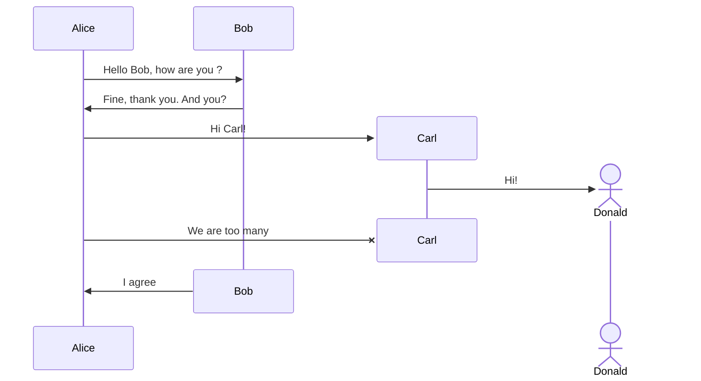

::::vp_tab

:::vp_tab_item **自定义`标题`**
内容区域
:::

:::vp_tab_item 内容是代码

```ts
const a = '可以是代码'
```

:::

:::vp_tab_item 内容是 markdown
**也可以是 markdown**
[baidu](https://www.baidu.com/)
:::

:::vp_tab_item 自定义的图表



:::

::::

---

::::::vp_tab

:::::vp_tab_item tab1
第一个标签页，可以嵌套内容

::::vp_collapse

:::vp_collapse_item collapse1
content1
:::

:::vp_collapse_item collapse2
content2
:::

:::vp_collapse_item collapse3
content3
:::

::::

:::::

:::vp_tab_item tab2
第二个标签页
:::

::::::
