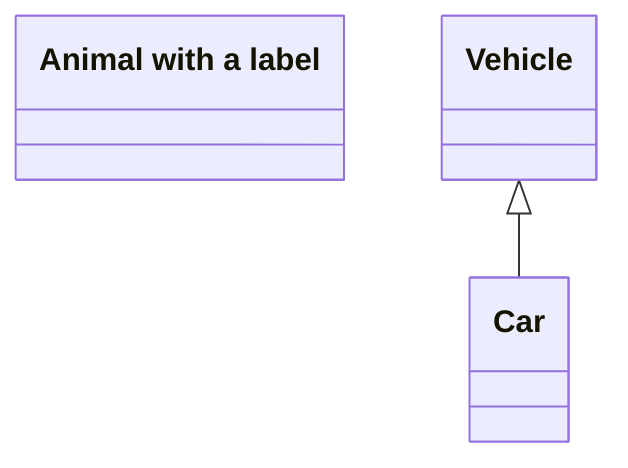

# Vitepress

## 介绍222

基于 vite+vue 的文档撰写工具

[vite 官网](https://vitepress.dev/zh/)

## 扩展

下面是介绍一些 markdown 扩展的使用

- 代码块，` ```plantuml `
- 代码块，` ```mermaid `
- 代码块，` ```vp_md `
- 脚注插件 footnote，`[^id]`
- 容器 collapse，`::::vp_collapse`，`:::vp_collapse_item`
- 容器 tabs，`::::vp_tab`，`:::vp_tab_item`
- 容器 col，`::::vp_col`，`:::vp_col_item`

### 演示组件 Demo

:::vp_demo



:::

### 折叠面板 Collapse

#### 示例 1

容器语法

:::vp_demo path="./docs/learning/vitepress/example-collapse.md"
:::

#### 示例 2

注释语法

:::vp_demo path="./docs/learning/vitepress/example-collapse2.md"
:::

### 标签页 Tabs

#### 示例 1

容器语法

:::vp_demo path="./docs/learning/vitepress/example-tabs.md"
:::

#### 示例 2

注释语法

:::vp_demo path="./docs/learning/vitepress/example-tabs2.md"
:::

### 两列布局 Col

#### 示例 1

容器语法

:::vp_demo path="./docs/learning/vitepress/example-col.md"
:::

#### 示例 2

注释语法

:::vp_demo path="./docs/learning/vitepress/example-col2.md"
:::
